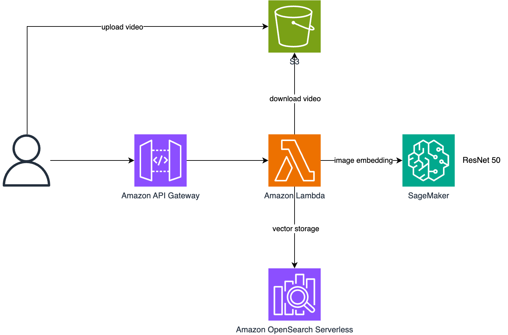

<p align="center">
    【中文 | <a href="README.md">English</a>】
</p>

# sample-for-video-similarity-using-serverless

## 项目背景
短视频平台大行其道，每天产出大量视频，存在许多创作者盗用他人视频发布的问题，需要通过技术手段识别出相似的视频。

传统的识别方法通常依赖于手工检测和简单的应用，比如识别视频标题或说明。但是，随着大量数据的产生，此类方法无法高效地处理并符合免循环和免亲自性。为了解决这些问题，推出该项目，通过高效的统一识别模型实现自动视频相似性检测。

---

## 实现原理
### 视频相似度对比
1. 视频抽帧：使用 OpenCV 对视频进行均匀抽帧
2. 特征提取：利用预训练的 ResNet50 模型将每一帧转化为 1000 维的特征向量
3. 向量矩阵计算：将所有帧的特征向量组成矩阵
4. 相似度计算：使用余弦相似度等算法计算两个视频的相似度得分

### 相似视频检索
1. 向量存储：将视频特征向量存入 Amazon OpenSearch 向量数据库
2. 近似检索：使用 KNN 算法进行高效的向量相似度检索
3. 二次排序：对检索结果进行精确相似度计算，得到最终排序结果

---

## 项目架构


---

## 运行方式

### 1. 在 AWS Marketplace 上订阅并部署 ResNet50
订阅链接：[ResNet50 订阅](https://aws.amazon.com/marketplace/ai/procurement?productId=cc879d3b-e759-4270-9afb-ceb50d2f7fe6)

1) 完成部署后，记住 SageMaker Endpoint Name；

### 2. CDK 一键部署
1) 安装 AWS CDK：请参考 [CDK 安装指南](https://docs.aws.amazon.com/cdk/v2/guide/getting_started.html)
2) clone 项目到本地，使用 CDK 一键部署：
```bash
cd src/cdk
# 示例：指定 SageMaker 终端名
cdk deploy --parameters sagemaker_endpoint=ResNet50
```
3) 获取 API Gateway Endpoint；
4) 创建 OpenSearch 索引：
```bash
curl --location 'https://{{apigateway.endpoint.url}}/create_opensearch_index' \
--header 'Content-Type: text/plain' \
--data '{}'
```

---

## API 文档

### 获取视频向量
* **Path**: `/get_video_vector`
* **Method**: POST
* **Request Params**:
```json
{
    "video_url": "s3://your_bucket/test.mp4"
}
```
* **Response**:
```json
{
    "video_vectors": {
        "image_001": [0.2212321, 0.2212321...],
        "image_002": [0.2212321, 0.2212321...],
        ...
    }
}
```

###将视频向量插入到向量数据库中
* **Path**: `/insert_video_vector`
* **Method**: POST
* **Request Params**:
```json
{
    "video_url": "s3://your_bucket/test.mp4"
}
```
* **Response**:
```json
{"result": 136}
```

### 检索相似视频
* **Path**: `/search_similarity_videos`
* **Method**: GET
* **Request Params**:
```json
{
    "video_url": "s3://your_bucket/test.mp4",
    "size": 10
}
```
* **Response**:
```json
{
    "videos": [
        {
            "video_url": "s3://your_bucket/test.mp4",
            "score": 0.99
        },
        {
            "video_url": "s3://your_bucket/test.mp4",
            "score": 0.99
        },
        ...
    ]
}
```

### 对比两个视频相似度
* **Path**: `/video_similarity`
* **Method**: POST
* **Request Params**:
```json
{
    "video_url_1": "s3://your_bucket/test.mp4",
    "video_url_2": "s3://your_bucket/test.mp4"
}
```
* **Response**:
```json
{
    "score": 0.92
}
```

---

## FAQ

1. **为什么选择 ResNet50 模型？**
   ResNet50 是一个充分证明的平衡模型，具备优秀的图像分类和特征提取能力，适合用于视频向量化任务。

2. **OpenSearch 是否支持加密搜索？**
   支持通过加密通道（HTTPS）和访问控制功能保护数据安全。

3. **如何实现视频原始文件和向量数据的维护？**
   推荐使用 Amazon S3 作为视频存储，并使用 Lambda 举进行实时调用和向量添加。

## 贡献指南

参见 [CONTRIBUTING](CONTRIBUTING.md).

## 安全政策

参见 [CONTRIBUTING](CONTRIBUTING.md#security-issue-notifications).

## License

This library is licensed under the MIT-0 License. See the LICENSE file.